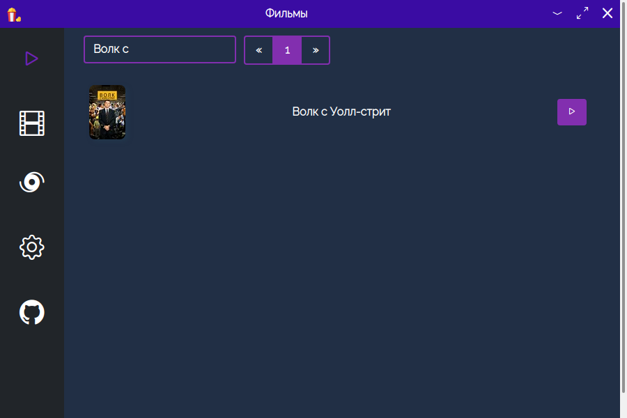

# 🎬 Films-Combo

[![russian-readme](https://img.shields.io/badge/Readme-ru-blue.svg?logo=data:image/png;base64,iVBORw0KGgoAAAANSUhEUgAAAgAAAAIACAMAAADDpiTIAAAAA3NCSVQICAjb4U/gAAAACXBIWXMAAA3XAAAN1wFCKJt4AAAAGXRFWHRTb2Z0d2FyZQB3d3cuaW5rc2NhcGUub3Jnm+48GgAAAYxQTFRF////9fX1/0tV9fX1/0tV9fX1/0tV9fX1/0tV9fX1/0tV9fX1/0tV9fX1/0tV9fX1/0tV9fX1/0tV9fX1/0tV9fX1/0tV9fX1/0tV9fX1/0tV9fX1/0tV9fX1/0tV9fX1/0tV9fX1/0tV9fX1/0tV9fX1/0tV9fX1/0tV9fX1/0tV9fX1/0tV9fX1/0tV9fX1/0tV9fX1/0tV9fX1/0tV9fX1/0tV9fX1/0tV9fX1/0tV9fX1/0tV9fX1/0tV9fX1/0tV9fX1/0tV9fX1/0tV9fX1/0tV9fX1/0tV9fX1/0tV9fX1/0tV9fX1/0tV9fX1/0tV9fX1/0tV9fX1/0tV9fX1/0tV9fX1/0tV9fX1/0tV9fX1/0tV9fX1/0tV9fX1/0tV9fX1/0tV9fX1/0tV9fX1/0tV9fX1/0tV9fX1/0tV9fX1/0tV9fX1/0tVQ0eaQ0mc9fX1/0tV9fX1/0tV9fX1/0tV9fX1/0tV9fX1/0tV9fX1/0tV9fX1/0tV9fX1/0tVQUeb9fX1/0tVyoaScQAAAIF0Uk5TAAEBAwMFBQcHCgoMDBISGBgZGR4eICAhIScnKys6Ojs7Pz9AQEFBR0dISFRUWVlcXGFha2tubnp6e3uCgoiIjo6VlZeXmJiZmZqaoqKrq66ur6+0tLW1tra4uLq6yMjJycvLz8/T093d3t7i4unp6urs7PPz9PT5+fr6+/v8/P7+lvis4gAABNtJREFUeNrt3NWWFQcURdGNu7u7azfu7u4kuDsJ7pLkx/MACQ00DQ1PXWfOT9hn3XqoGuMmAAAAAAAAAAAAAAAAAAAAAAAAAAAAAAAAAAAAAAAAAAAAAAAAAAAAAAAAAMC39Bk1acGKDftO/UYXc2rfhhULJo3q8yvHn7ftzt90cXe2zfupCAYtOfDIes3w6MCSQZ08/6Qzr+zWJK/OTOrE+ccdsljzHBr3g+cfssOvv5lPgR1DfuD8/dY9MVVTPVnX73v3H3HFTE12ZUTH959yz0bNdm9KR/dveWahpnvW8s3z99hkngo29Wj//r1O2KaGE73aDWCXZarY1d79l9mljmVf33+Wtz+FvJr15f3HPLBKJQ/GfH7/AddsUsu1AZ8FsMci1expe/8JbwxSzZsJbQI4Zo96jn26/wxrVDTjv/t3u2SMii51+xjAIlvUtOjjN6Bbpqjp1oevQtMsUdW0JImPwGVtSpLcMERVN5Jkgh3qmpBklRnqWpXkghnqupAMe2eGut4NyxwrVDYnLUaorCVrjFDZmmwxQmVbcsQIlR3JOSNUdi7+Bai0O3lhhMpexAa1CUAACAABIAAEgAAQAAJAAAgAASAABIAAEAACQAAIAAEgAASAABAAAkAACAABIAAEgAAQAAJAAAgAASAABIAAEAACQAAIAAEgAASAABAAAkAACAABIAAEgAAQAAJAAAgAASAABIAAEAACQAAIAAEgAASAABAAnQjgT0rLX5QmAAEgAASAABAAAkAACAABIAAEgAAQAAJAAAgAASAABIAAEAACQAAIAAEgAASAABAAAkAACAABIAAEgAAQAAJAAAgAASAABIAAEAACQAAIAAEgAASAABAAAkAACAABIAAEgAAQAAJAAAgAASAABIAAEAACQAAIAAEgAASAABAAAkAACAABIAAEgAAQAAIQAAJAAAgAASAABIAAEAACQAAIAAEgAASAABAAAkAACAABIAC6dgB/UFr+oTQBCAABIAAEgAAQAAJAAAgAASAABIAAEAACQAAIAAEgAASAABAAAkAACAABIAAEgAAQAAJAAAgAASAABIAAEAACQAAIAAEgAASAABAAAkAACAABIAAEgAAQAAJAAAgAASAABIAAEAACQAAIAAEgAASAABAAAqATAby0QWUvc9cIld3NeSNUdj5HjVDZ0Ww1QmVbs9YIla1NqxEqa81cI1Q2N8PfW6Gu98OTi2ao62KS1Waoa3WSiWaoa2KS3LRDVTeTJJsNUdXmJMl0Q1Q1PUnS87YlarrdM0mSxaaoafGH+6f7ZVtUdLn7xwAy0xgVzcz/jlujnuOf7p+Jb+1RzduJbQLIXoNUs7ft/TPwukVquT7wswAy9qFNKnk4Nl+Y/doqdbyena8sN0sdy9OO3XapYnd790/vk5ap4WTvdgNITx+GS9jcM9/S+tw8Tfe8NR2Yet9CzXZ/ajo08qqNmuzqyHxH//VPzdRUT9f3z/cN3emdUCO93jk0P2b8YWs1z+Hx+XGTz3oKNOvXf3ZyOmfw0oOP7dYMjw8uHZyf0Hf+dv8g1OXd3T6/b35e39GTF67cuP/073Qxp/dvXLlw8uhfOT4AAAAAAAAAAAAAAAAAAAAAAAAAAAAAAAAAAAAAAAAAAAAAAAAAAAAAAAAANN2/NhLYDHwLPUgAAAAASUVORK5CYII=)](https://github.com/fukttt/nnmgui/blob/main/README-ru.md)

Small Electron app that allows you to watch movies, serials and anime.

# feautures 

* Search 
* First 20 items from cloud 
* Online browsing with history saving 

# about

* Saves the time you left off.

* Search by film-name.

# Установка 

Download [release](https://github.com/fukttt/nnmgui/releases)

Run installer.

The application icon will automatically appear on the desktop, with which you can open the application and use it.

---
Built w/ ❤️

